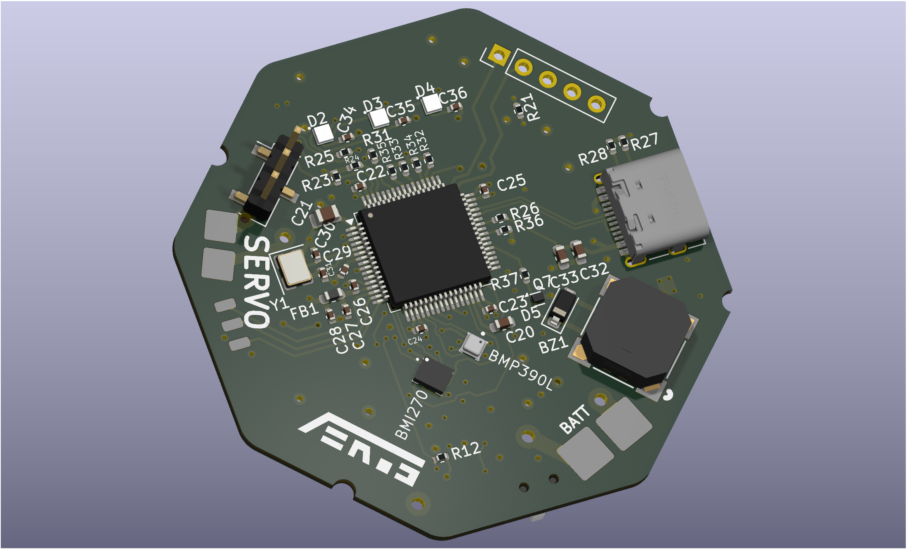
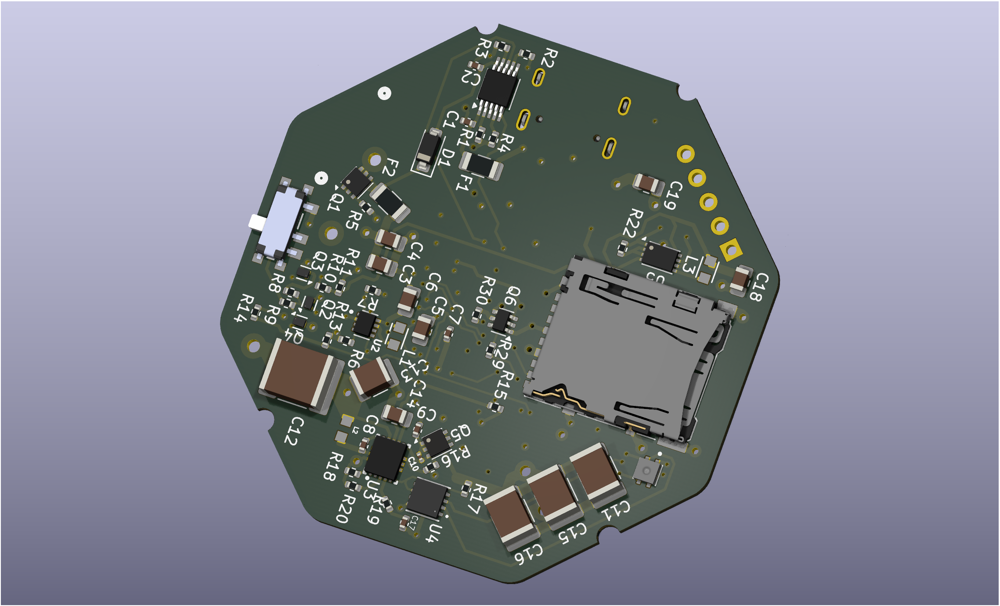

# AERoS
## An All-Encompassing Rocket System

[]()

A high-performance, compact rocket flight controller board designed around the **STM32F411RET6** microcontroller. This board integrates power management, sensor telemetry, state logging, and servo control into a single-cell Li-Po powered solution optimized for model rocketry and high-altitude aerospace tracking.

## **CRITICAL DISCLAIMER:**
*This board is currently in the active development phase. It has been fully routed and designed, but it has **NOT** been physically manufactured or bench-tested yet.*

## Board Previews & Renders

*(No 3D-models for L1, L2, and L3 were available)*

| Front 3D Render | Back 3D Render |
| :---: | :---: |
| <!-- Replace with your front render path e.g.,  -->  | <!-- Replace with your back render path e.g.,  -->  |

---

## 🛠Hardware & Board Specifications

### Core Processing & Power System
* **Microcontroller:** STM32F411RET6 (ARM Cortex-M4, 100MHz, 512KB Flash, 128KB SRAM).
* **Power Source:** Designed explicitly for a **Single-Cell Lithium-Polymer (Li-Po)** battery (~3.7V–4.2V).
* **USB Interface:** USB-C 2.0 interface supporting both data communication and **on-board USB battery charging**.
* **Power Switch:** Featuring a **self-latching MOSFET-based power switch** to enable digital soft-on/soft-off control or mechanical/pyrotechnic separation deployment triggers.
* **Actuator Power:** Integrated **Step-up (Boost) Converter** dedicated to delivering stable, elevated voltages required for servo actuation.

### Peripherals & User Interface
* **Indicators:** 3x Addressable/Configurable **RGB LEDs** for real-time state indication (e.g., pre-flight, armed, error, data logging active).
* **Acoustic Telemetry:** On-board **Piezo Buzzer** for audible flight readiness chirps, continuity checks, and recovery beacons.
* **Storage:** **D3AT SD Card Slot** wired via high-speed interface for high-rate blackbox flight logging.
* **Debugging:** Dedicated **ST-Link Connector** for SWD programming, flashing, and real-time debugging.

---

### System Architecture
<!-- Space for top-level or sheet-specific schematic screenshots as they relate to system blocks -->
```
   +-----------------------------------------------------------------+
   |                        USB-C 2.0 / Charger                      |
   +-----------------------------------------------------------------+
                                    |
                                    v
   +-------+           +-------------------------+           +-------+
   | Battery| ------>  | Self-Latching MOSFET SW |  -------> | Regs  |
   +-------+           +-------------------------+           +-------+
                                                                 |
            +-----------------------+------------+---------------|
            |                                    |               v
            v                                    v       +---------------+
   +-----------------+                  +------------+   | Servo Boost   |
   | STM32F411RET6   | <--- SPI/I2C --- | Sensor Bus |   +---------------+
   | Microcontroller |                  +------------+           |
   +-----------------+------+                                    v
    |      |        |       |                              [ Servo Pins ]
    v      v        v       v
  [LEDs][Buzzer][SD Card][ST-Link]
```
For schematics, open the project file through KiCad 9.0 (can be found in the `board` directory)

<!-- #### Schematic Insights -->
<!-- <!-- Replace the placeholders below with cropped screenshots of your multi-sheet KiCad schematics -->
<!-- * **Power Management Sheet:** * *Includes USB charging circuit, battery protection, self-latching MOSFET stage, and the servo boost regulator.* -->
<!--     * <!--  --> **[Insert Power & Latching Schematic Screenshot Here]** -->
<!-- * **MCU & Breakouts Sheet:** -->
<!--     * *Includes STM32 pinouts, crystal oscillators, decoupling capacitors, and ST-Link header.* -->
<!--     * <!--  --> **[Insert MCU Core Schematic Screenshot Here]** -->

---

## On-Board Sensors

The sensor suite communicates over optimized I2C/SPI buses to provide highly accurate 9-DOF inertial, environmental, and barometric data.

| Sensor Part Number | Type | Primary Flight Function |
| :--- | :--- | :--- |
| **BMI270** | 6-Axis IMU (Accel/Gyro) | Rocket orientation, acceleration profiling, launch detection, and apogee sensing. |
| **BMP390L** | High-Precision Barometer | Precise altitude tracking, descent-rate monitoring, and main/drogue parachute deployment triggering. |
| **SHTC3** | Humidity & Temp Sensor | Environmental monitoring and internal enclosure/payload bay diagnostics. |

---

## Design & Development

* **EDA Software:** Designed completely using **KiCad**.
* **Firmware Compatibility:** Perfect pairing with STM32CubeIDE, HAL libraries, or custom bare-metal C/C++ architectures.

### Future Scope / Additions (To-Do)
- [ ] Physical PCB manufacturing and assembly (PCBA evaluation).
- [ ] Continuity testing on the self-latching MOSFET network.
- [ ] Bench testing the Step-Up regulator under maximum servo load.
- [ ] Developing a comprehensive flight firmware stack (Blackbox logging framework, Kalman filtering for apogee detection).
- [ ] Pinout map cheat-sheet (Markdown table matching STM32 pins to hardware blocks).

---

## License & Copyright

This project is licensed under the **GNU GPL v3** License. 

```
Copyright (c) 2026 Karthikeya Turimalla (TKAman23)

This program is free software: you can redistribute it and/or modify
it under the terms of the GNU General Public License as published by
the Free Software Foundation, either version 3 of the License, or
(at your option) any later version.
```
See the accompanying `LICENSE` file for full terms and conditions.

---

## Attribution Request

If you use parts of this repository, please reference the repository, my username (TKAman23), or me (Karthikeya Turimalla) in your work.

---

## Contributing & Feedback

Since this project is in active prototyping, discussions, issues, and pull requests regarding optimization (especially around power management and thermal layout) are generally welcome!
Contact: [karthikeyaat@gmail.com](mailto:karthikeyaat@gmail.com).
